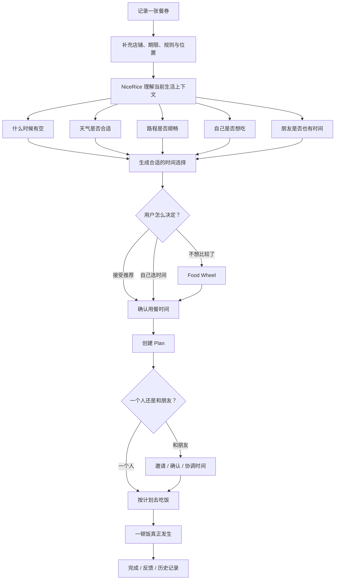
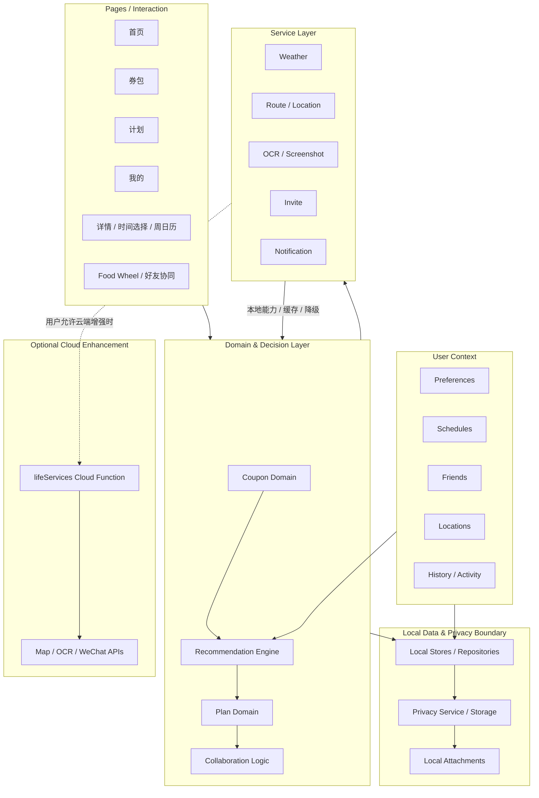
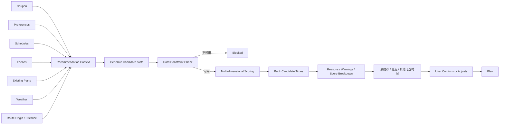
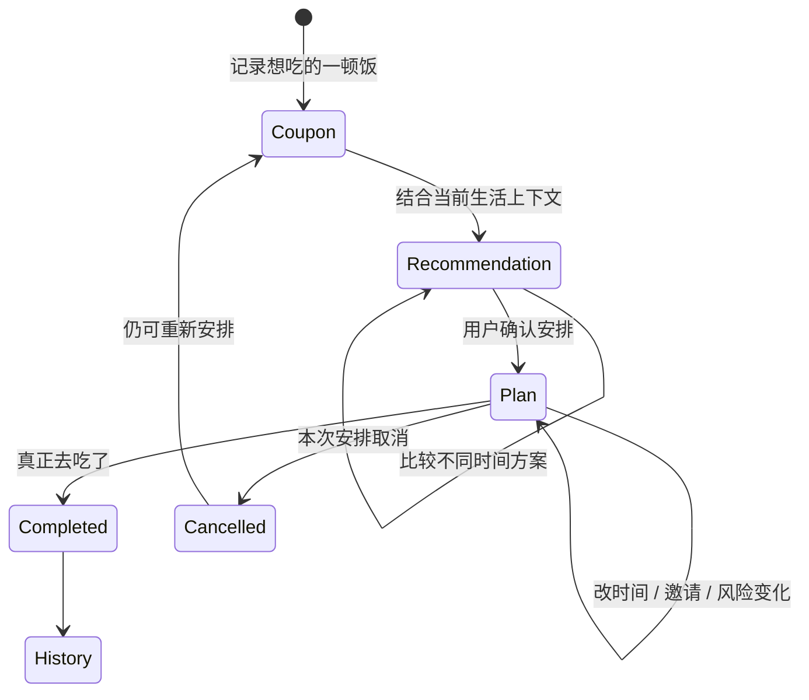
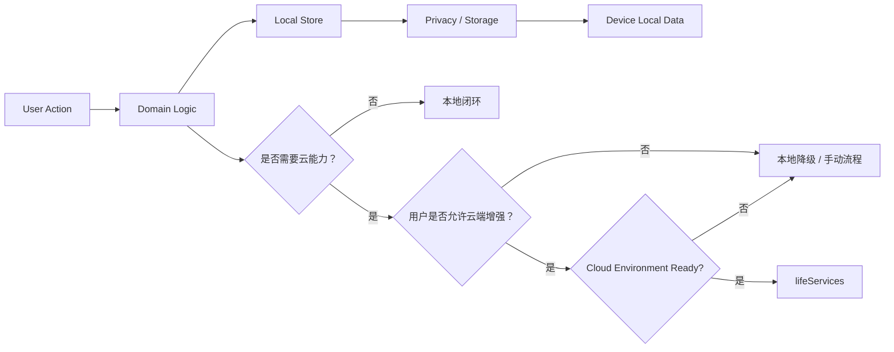

# NiceRice Architecture

> **先讲一顿饭怎样发生，再讲系统怎样把它实现出来。**

NiceRice（有时好饭）的核心不是“管理优惠券”，而是帮助用户把一份**有期限的餐券约定**，变成一顿真正发生的饭。

这份文档描述当前主分支的产品流程与系统架构。它关注职责、数据流和边界，不试图穷举所有页面函数或实现细节。

---

## 1. Core Concepts

NiceRice 当前最重要的四个领域概念是：

| Concept | Meaning |
| --- | --- |
| **Coupon** | 一份有期限、有地点、有规则的餐券约定，是“想去吃什么”的起点 |
| **Recommendation** | 基于现实生活上下文生成的决策辅助，不替用户做最终决定 |
| **Plan** | 用户接受某个时间与安排后形成的生活计划，是已经确认的执行意图 |
| **History / Feedback** | 一顿饭真正发生、取消或调整后的结果，用于记录生活，而不是只记录券的状态 |

其中：

- Coupon 是待兑现的约定；
- Recommendation 是“什么时候最合适”的建议；
- Plan 是用户真正接受的安排；
- History 是这顿饭最终有没有发生。

这四层共同构成 NiceRice 的核心闭环。

---

## 2. User Flow：一张餐券怎样变成一顿饭



这个流程里，推荐不是终点。

**真正的终点是那顿饭发生了。**

用户也不必严格遵循推荐结果：可以接受推荐、改时间、临时取消，或者干脆用 Food Wheel 做一次轻松的决定。

---

## 3. Product Surfaces

当前小程序的四个主入口分别承担不同角色：

| Surface | Responsibility |
| --- | --- |
| **首页** | 告诉用户“最近有什么值得安排”，承接天气、优先级与近期推荐 |
| **计划** | 管理已经准备去做的事情，包括本周安排、风险、完成与取消 |
| **券包** | 管理还没有兑现的餐券约定，并支持筛选、比较与进入推荐 |
| **我的** | 管理影响决策的用户上下文，如偏好、地点、日程、朋友与隐私设置 |

此外还有券详情、计划确认、计划详情、时间选择、周日历、Food Wheel、好友时间热力图等页面，用于完成具体交互。

从产品职责上看，可以把它们理解为：

```text
券包：我想吃什么
首页：最近什么值得安排
计划：我已经决定要去做什么
我的：系统需要了解怎样的我
```

---

## 4. System Architecture

NiceRice 当前采用 **Local-first + Optional Cloud Enhancement** 的结构。

核心决策与数据闭环优先在小程序本地完成；天气、路线、OCR、跨设备邀请和订阅消息等能力通过 service 抽象，并在需要时使用微信云函数增强。



### Layer responsibilities

#### Pages / Interaction

负责用户交互和页面状态，例如：首页展示、券筛选、计划确认、朋友时间选择。

页面层应尽量消费已有 domain / service 接口，而不是重新实现推荐规则或数据协议。

#### Domain & Decision Layer

这里承载 NiceRice 最核心的业务语义：

- Coupon 的统一结构、状态与使用规则；
- Recommendation 的候选时间生成、约束检查、评分与解释；
- Plan 的创建、状态变化与风险；
- 多人协同与邀请逻辑。

#### User Context

推荐不是只看一张餐券本身，还依赖当前生活上下文：

- 饮食与时间偏好；
- 已有固定日程；
- 常用地点和路线起点；
- 朋友可约时间；
- 已有计划和历史活动。

这些信息共同回答：**“这顿饭现在适不适合发生？”**

#### Local Data & Privacy Boundary

Coupon、Plan、Preference、Friend、Schedule、Activity 等主要状态通过本地 store / repository 管理。

隐私层位于持久化和云能力之间，负责统一管理本地数据访问、隐私模式和附件保护。

当前默认策略是：

```text
localOnly = true
cloudUploadEnabled = false
encryptAttachments = true
```

因此外部服务不是核心数据闭环的前提。

> Local-first 是当前架构策略；本地加密实现本身是否达到生产级安全标准，将在 `PRODUCTION_READINESS_AUDIT.md` 中单独审计。

#### Service Layer

Service 层把容易变化的外部能力和页面 / 推荐逻辑隔离开，包括：

- Weather
- Route / Location
- OCR / Screenshot
- Invite
- Notification

推荐引擎只需要消费统一后的上下文，而不需要知道底层具体使用哪一家地图、天气或 OCR provider。

#### Optional Cloud Enhancement

`cloudfunctions/lifeServices` 是当前统一的云端入口，主要承担：

- 路线估算；
- 逆地理编码；
- OCR；
- 计划邀请创建、读取、更新与撤销；
- 订阅消息发送。

当前 `CLOUD_ENV_ID` 默认未配置，因此这些能力不会成为本地核心流程的硬依赖。

---

## 5. Recommendation Data Flow

Recommendation Engine 的目标不是计算一个抽象的“券价值”，而是回答一个更具体的问题：

> **对于这张餐券，在当前生活上下文中，什么时间安排它比较合适？**



### 5.1 Candidate generation

系统先针对一张餐券生成候选用餐时段，而不是直接给整张券打一个固定分数。

这样可以区分：

```text
这家店值得去，但今天不合适
这张券这周值得安排，但周三比周五更合适
这顿饭适合自己去，但和某位朋友时间对不上
```

### 5.2 Hard constraints first

明显不可执行的方案先被阻断，例如：

- 不符合餐券使用规则；
- 时间已经过去；
- 候选时间已经超过餐券期限。

这类情况不会只依靠“扣一点分”解决，而会被标记为 blocked。

### 5.3 Multi-dimensional scoring

可执行候选再结合多个维度评估。目前主要考虑：

```text
期限与安排紧迫度
已有日程
时间偏好
时段适配
天气
距离
个人偏好
餐后缓冲
预约要求
近期口味重复
餐券价值
```

这些评分最终被组合成候选时段的综合结果。

### 5.4 Explainability

Recommendation 不只返回一个 score，同时保留：

```text
reasons
warnings
blockers
scoreBreakdown
recommendedTime
```

因此页面能够解释：为什么推荐这个时间、有哪些风险、为什么某个时间不适合。

---

## 6. Coupon → Recommendation → Plan

三个核心对象承担不同职责：



这里有一个重要边界：

**Recommendation 不直接修改用户生活，Plan 才代表用户接受了一个安排。**

这让推荐系统始终保持“辅助决策”的角色。

---

## 7. Local-first Data Flow

本地优先不是简单的“没有后端”，而是一个明确的架构选择：



因此：

- 没有云环境时，餐券、推荐、计划等核心功能仍应可运行；
- 路线、OCR、跨设备同步等能力可以降级；
- 用户是否允许上传私人信息，是调用云能力之前的一道明确边界。

---

## 8. Current Implementation Map

下面是当前代码中主要职责与位置的对应关系：

| Responsibility | Main location |
| --- | --- |
| 小程序页面 | `miniprogram/pages/` |
| Coupon 领域逻辑 | `miniprogram/utils/coupon/` |
| Plan 领域逻辑 | `miniprogram/utils/plan/` |
| 推荐门面 | `miniprogram/utils/recommendation.js` |
| 推荐子模块 | `miniprogram/utils/recommendation/` |
| 本地 stores | `miniprogram/utils/*Store.js` |
| Privacy / local persistence | `miniprogram/utils/privacyService.js`、`storageManager.js` |
| 外部能力抽象 | `miniprogram/utils/services/` |
| 云服务统一入口 | `cloudfunctions/lifeServices/` |

推荐模块当前进一步拆分为：

```text
slotGenerator.js
    候选时段、时间工具、冲突检查

weatherScorer.js
    天气场景与天气适配

preferenceScorer.js
    日程、距离、偏好、预约等子评分

scoringEngine.js
    上下文构建、综合评分、推荐结果、周排程
```

`recommendation.js` 对页面提供统一 façade，避免不同页面分别复制推荐逻辑。

---

## 9. Architectural Boundaries

为了保持 NiceRice 的核心清晰，当前有几条重要边界。

### Recommendation is not automation

推荐可以建议，但不应该未经确认自动替用户创建或修改生活安排。

### Cloud is enhancement, not the product core

NiceRice 的核心价值不是“接了多少 API”。外部 API 只是帮助系统更理解现实条件。

### Social is coordination, not a social network

好友能力服务于“一顿饭能不能约成”，不以构建复杂社交关系链为目标。

### Coupon is the trigger, not the final product

餐券是一次具体约定的载体；产品真正关心的是：**用户有没有在忙碌的生活里，找到一个可以好好吃饭的时间。**

---

## 10. What This Architecture Does Not Claim

这份架构文档描述的是当前代码结构和产品方向，不代表所有能力已经达到生产环境标准。

尤其以下内容需要在 production-readiness audit 中继续验证：

- 云环境和真实第三方服务部署；
- 生产级密钥与配置管理；
- 本地加密方案安全性；
- 跨设备邀请一致性与异常恢复；
- 数据迁移与备份恢复；
- 网络失败和 provider 限流；
- 测试覆盖、CI 与发布门禁；
- 真机端到端验证；
- 微信平台隐私与上线合规要求。

下一步见：

```text
docs/PRODUCTION_READINESS_AUDIT.md
```

---

## 11. In One Sentence

NiceRice 的系统可以被概括为：

> **把一份有期限的餐券约定，与用户真实的时间、地点、天气、偏好和同行人放在一起，找到一个合适的时刻，再让这个时刻变成真正发生的一顿饭。**
